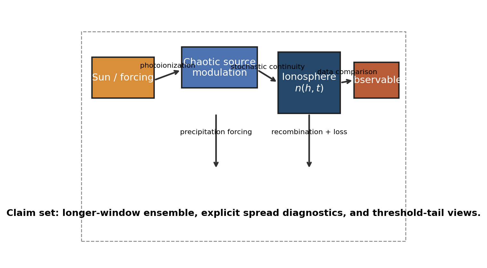
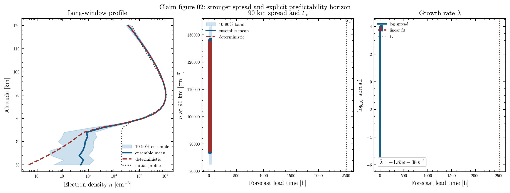
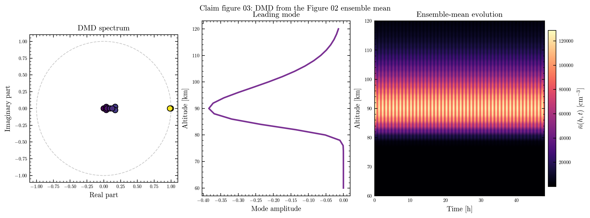
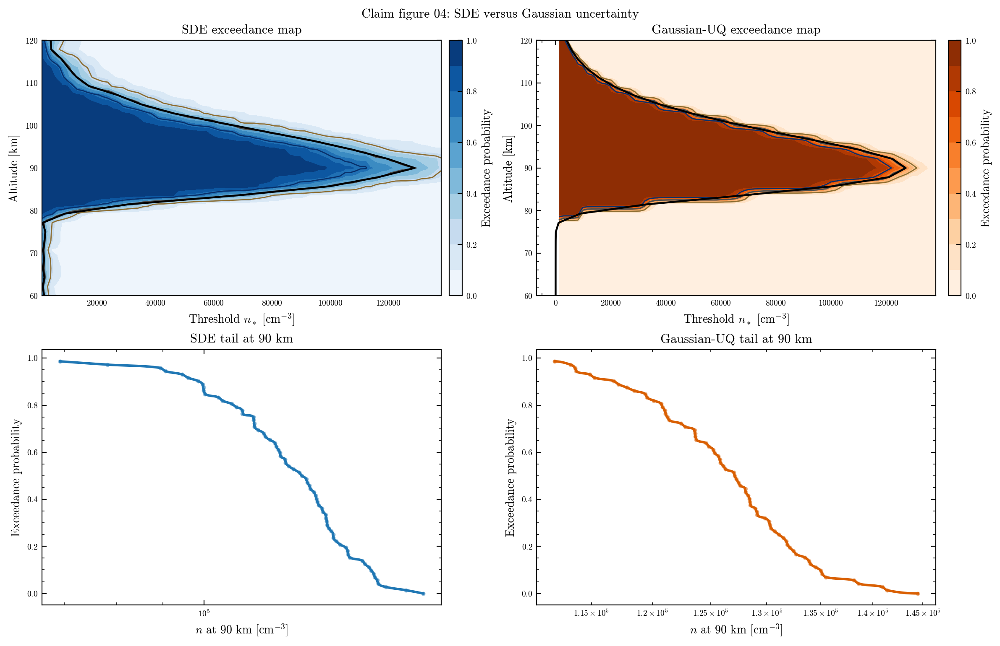

# Claim Figure Set

This page documents the alternate numbered figure namespace:

- `fig01_swmi_schematic.png`
- `fig02_sde_ensemble.png`
- `fig03_transfer_operator.png`
- `fig04_exceedance.png`

The baseline figures remain in [Figure Notes](figure_notes.md). This separate
set exists so the paper-facing figure naming can evolve without overwriting the
original reference outputs.

At the moment, the claim set is generated from the same model family as the
baseline set, but with visibly different layouts and parameter overrides. The
goal is to keep the baseline reference figures intact while giving the paper
revision its own figure track.

## Why keep a second set

The repository now serves two related but distinct purposes:

- the baseline figures document the current implementation
- the claim figures provide a parallel namespace for the paper narrative

That separation is useful when captions, ordering, or manuscript structure
change but the underlying scientific model should remain traceable.

## Figure 01: SW-M-I schematic

This schematic uses the same conceptual flow as the baseline version, but it
adds a framed callout and explicit claim-set annotation. It still answers the
question:

- where does external forcing enter?
- where does the density state evolve?
- how do source terms connect to the forecast output?

The figure is useful because it gives a compact map of the workflow before the
equations are introduced, while making the paper-facing namespace obvious.

## Figure 02: Deterministic versus stochastic ensemble

This figure is a wider, three-panel version of the baseline plot:

- the left panel shows the long-window final profile
- the middle panel shows the 90 km spread and predictability horizon
- the right panel shows the spread-growth rate on a log scale

It answers the same practical question as the baseline version, but with more
explicit chaos diagnostics:

- how much spread appears once stochastic forcing is included?
- does the forecast remain narrow, or does it fan out across time?

The numbered claim version keeps the manuscript-ready naming separate from the
reference plot and makes the spread growth easier to see.

## Figure 03: Transfer-operator / DMD diagnostic

This figure now uses the Figure 02 ensemble mean as its input, so it is tied
directly to the claim ensemble output rather than a separate synthetic signal.

It is still the place to look for:

- dominant oscillatory or decaying modes
- how compressible the ensemble sequence is
- whether a low-rank representation captures the main structure

The claim namespace keeps this diagnostic available for the paper revision and
lets the reader see the mean state evolution next to the DMD spectrum.

## Figure 04: Exceedance probability and tail risk

This figure is now a side-by-side comparison of SDE and Gaussian uncertainty.

The top row compares exceedance maps:

- left: SDE ensemble
- right: Gaussian-UQ ensemble

The bottom row compares 90 km tail probabilities for the same two methods.

That makes the figure a natural fit for the paper narrative, where threshold
crossing is often more important than the mean profile and where the contrast
between stochastic propagation and Gaussian perturbation is the key message.

## Reading the two sets together

Use the baseline figures when you want:

- the implementation reference
- the original file names
- the current documentation trail

Use the claim figures when you want:

- paper-ready numbering
- a parallel namespace for manuscript revisions
- a place to compare alternate captioning or layout choices later

The scientific content is still the same model family. The difference is the
organization and intended manuscript context.
