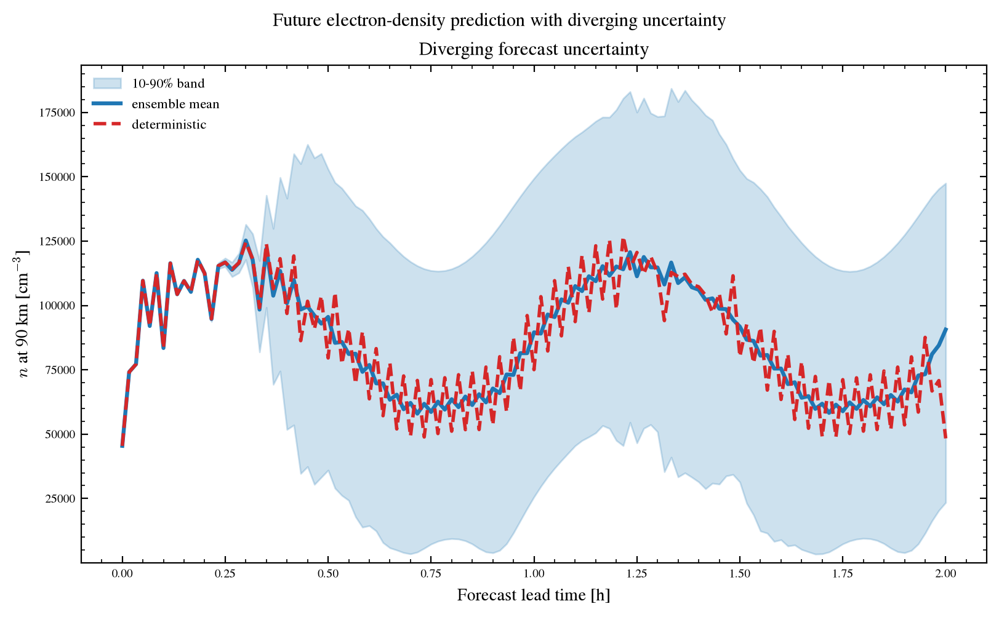

# Example Forecast

This page explains the generated forecast figure that shows diverging electron
density uncertainty with lead time.

The script behind the figure is:

`scripts/plot_future_uncertainty_forecast.py`

It uses the shared `lorenzsw` model code, the shared `model_params.json`, and
the ensemble solver.

## What the plot shows

The figure has one panel at 90 km altitude.

- the red dashed curve is the deterministic forecast
- the blue curve is the ensemble mean
- the blue shaded region is the 10 to 90 percent uncertainty band

The key point is that the band widens with time. That widening is the visual
signature of forecast divergence.

The layout is intentionally simple because this figure is meant to answer one
question clearly: how quickly does uncertainty grow at a physically relevant
ionospheric altitude?

The growth of forecast spread is the same basic predictability issue that
appears in classical chaos studies [Lorenz 1963](references.md#lorenz-1963),
while the use of an ensemble band reflects stochastic-forecast practice in
atmospheric modeling [Berner et al. 2017](references.md#berner-2017).

## Why 90 km matters

The altitude near 90 km sits in the lower ionosphere, where electron density
affects:

- radio absorption
- propagation through the D-region
- coupling to auroral and solar-driven forcing

This is a physically interesting altitude because it is low enough for chemical
loss to matter strongly, but high enough that space-weather forcing still plays a
major role.

## Major terms in the forecast

### Electron density

`n(h,t)` is the number density of free electrons.

It is the variable the continuity equation evolves in time.

In space physics, this is one of the key state variables because it controls
radio propagation, absorption, and coupling to the neutral atmosphere.

### Deterministic trajectory

The deterministic line is the same continuity model with the stochastic term
removed.

It answers the question:

"If the forcing were perfectly known, what would the model predict?"

### Ensemble mean

The ensemble mean is the average across many stochastic realizations.

It is often smoother than any one member, but it is not a physical truth. It is
the center of the model-generated distribution.

### Uncertainty band

The 10 to 90 percent band shows the central range occupied by most ensemble
members.

This is useful because:

- it shows spread rather than only the mean
- it is robust to a few extreme members
- it is easy to compare with a deterministic line

### Lead time

Lead time is the forecast horizon measured from the initial condition.

As lead time increases, small differences in forcing and noise can accumulate.
That is the uncertainty growth the figure is designed to show.

## Why the forecast spread grows

Spread increases because the model contains multiplicative stochastic forcing.
That forcing is small at first, but it is applied repeatedly over time.

The result is typical of chaotic and stochastic systems:

- early-time forecasts stay close together
- later forecasts separate
- the ensemble becomes a cloud of physically plausible outcomes

This is the same qualitative behavior seen in many nonlinear geophysical
systems: uncertainty does not grow linearly forever, but it usually grows fast
enough that the long-range forecast becomes probabilistic.

## Connection to the governing equation

The forecast is based on the same continuity equation used throughout the
repository:

`dn/dt = production - loss + stochastic forcing`

The major production terms are:

- Chapman photoionization
- precipitation-driven ionization

The major loss terms are:

- quadratic recombination
- linear removal

That is why the figure is useful scientifically. It is not a synthetic random
walk; it is the uncertainty of a physical model.

The precipitation term matters here because it is localized in altitude and can
push the solution away from the background Chapman state. In the figure, that is
part of what creates the visible spread in the 90 km time series.

## How to read the figure

If the deterministic line stays within the ensemble band, the forecast is
relatively stable.

If the deterministic line moves toward the edge or outside the band, the future
is less certain.

If the band is very wide, the model is telling you that the system is highly
predictable only in a probabilistic sense.

For a reader new to space physics, the important idea is that the forecast is
not "failing." It is revealing the range of physically plausible ionospheric
states once uncertainty in forcing is propagated forward.

## Why this version is publication-oriented

The figure is styled to be closer to Nature or AGU conventions:

- no heavy debug grid
- inward ticks
- clean line hierarchy
- restrained color palette
- strong emphasis on the data rather than decoration

The lack of heavy grid lines is deliberate. For Nature or AGU style figures,
the axes should support the data, not compete with it.

That matters because the figure should communicate science, not software
diagnostics.
