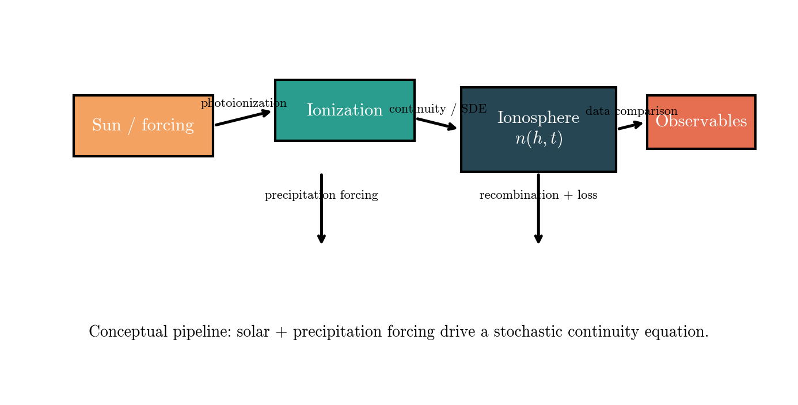
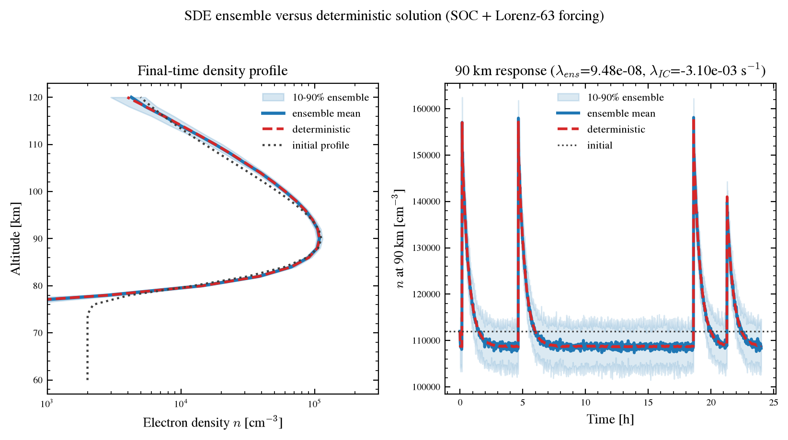
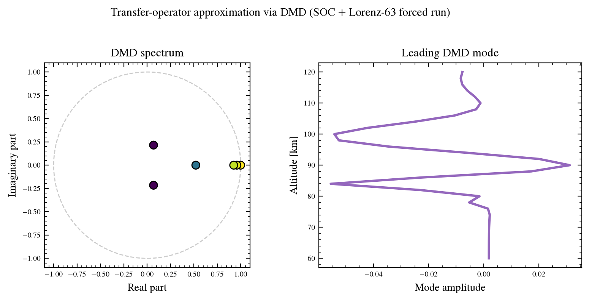
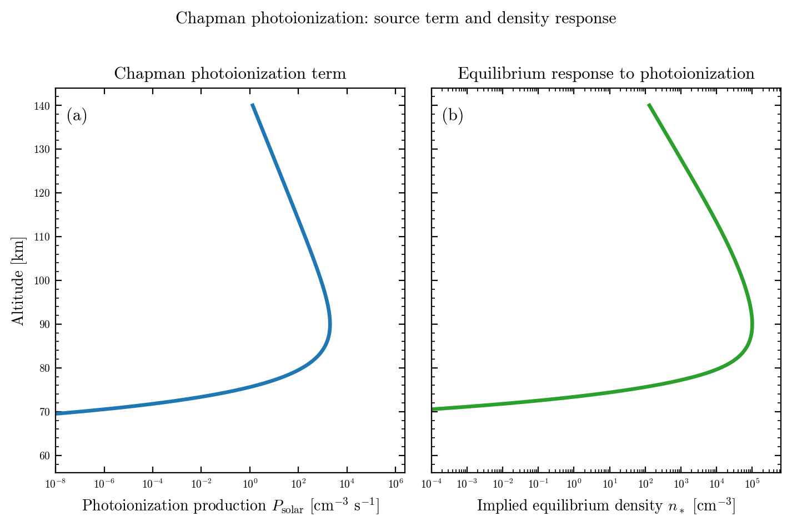
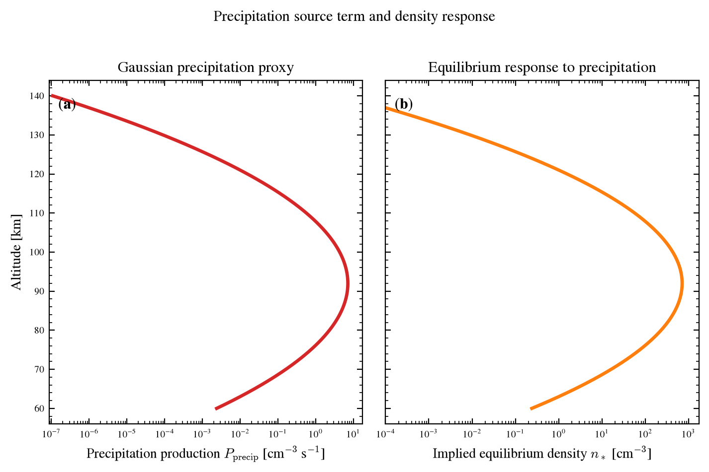

# Figure Notes

This page explains what each generated figure is showing, why it exists, and
which physical or statistical question it answers.

The intent is not just to label the plots. The intent is to show how each
figure connects back to the ionospheric forecast problem.

If you are looking for the alternate paper-claim numbering, see
[Claim Figure Set](claim_figure_notes.md).

## Figure 1: SW-M-I schematic

`fig1_swmi_schematic.png` is the conceptual map of the whole workflow.

It shows four linked pieces:

- solar and external forcing
- ionization and production
- the ionosphere state \(n(h,t)\)
- comparison against observables

What it means:

- the Sun and the upper atmosphere drive the source terms
- the continuity equation evolves the electron density
- the stochastic terms represent unresolved variability
- the output is compared against a measurable quantity, not just an abstract state

The reason this matters is the same one that motivates the whole project:
unresolved forcing can be represented as a stochastic process without losing the
physics [Lorenz 1963](references.md#lorenz-1963), [Berner et al. 2017](references.md#berner-2017).

Why it matters:

- it tells the reader that the model is not random by design
- it shows where the physical forcing enters
- it makes the stochastic continuity equation easier to explain to a new reader

Parameters:

- this schematic is not governed by a large parameter set
- it is a narrative figure, so its job is to communicate structure rather than
  fit a dataset

In short, Figure 1 is the "how the code thinks" diagram.

## Figure 2: Deterministic versus stochastic ensemble

`fig2_sde_ensemble.png` compares the deterministic solution with the ensemble
solution.

Left panel:

- final-time density profile versus altitude
- ensemble band shows the spread across realizations
- deterministic curve shows what the model predicts if the stochastic term is
  removed
- the initial profile is shown as a reference starting point

Right panel:

- the same ensemble, but reduced to the 90 km time series
- this makes uncertainty growth with time easy to see
- it is the simplest forecast-style view of the model

What problem this addresses:

- can a deterministic ionospheric model reproduce the central tendency?
- how much spread is produced once unresolved variability is added?
- does the system remain concentrated around one profile, or does it fan out?

Important parameters:

- `h_km_min`, `h_km_max`, `h_km_points`
  - altitude grid for the profile
- `t_end_s`, `t_step_s`
  - length and resolution of the forecast
- `P0_amp`, `P0_modulation`, `P0_period_s`
  - Chapman source strength and its time variation
- `Q0_amp`, `Q0_modulation`, `Q0_period_s`
  - precipitation source strength and its time variation
- `h_m_km`, `H_km`
  - Chapman peak altitude and scale height
- `precip_peak_offset_km`, `precip_H_p_km`
  - precipitation peak shift and vertical width
- `alpha_cm3s`, `beta_s`
  - recombination and linear loss
- `sigma0`, `beta_g`, `P_max`
  - stochastic forcing strength and modulation
- `n_members`, `seed`
  - ensemble size and random seed

Interpretation:

- if the ensemble band is narrow, the forecast is tightly constrained
- if it widens quickly, the solution is predictability-limited
- if the deterministic curve remains inside the band, the deterministic model is
  still representative of the ensemble center

This figure is the clearest demonstration of why the stochastic extension is
needed.

## Figure 3: Transfer-operator / DMD diagnostic

`fig3_transfer_operator.png` is not a direct forecast. It is a reduced-order
diagnostic.

Left panel:

- the DMD eigenvalues in the complex plane
- points near the unit circle correspond to slowly decaying or oscillatory
  structures
- points farther from the unit circle decay more strongly

Right panel:

- the leading DMD mode as a function of altitude
- this tells you which vertical structure dominates the reduced model

What problem this addresses:

- can the ensemble snapshot sequence be compressed into a small number of
  coherent modes?
- are the main patterns persistent enough to be represented by a low-rank
  operator?
- does the simulated ionosphere evolve like a small set of dominant patterns
  rather than a completely arbitrary field?

Important parameters:

- `fig3_h_km_min`, `fig3_h_km_max`, `fig3_h_km_points`
  - altitude range for the synthetic snapshot field
- `fig3_t_min`, `fig3_t_max`, `fig3_t_points`
  - time sampling of the snapshot sequence
- `fig3_snapshot_amp_cm3`
  - amplitude of the generated state snapshots
- `fig3_snapshot_decay`
  - vertical/temporal damping of the synthetic sequence
- `fig3_snapshot_phase`
  - phase shift that introduces coherent evolution
- `fig3_dmd_rank`
  - number of retained DMD modes

Interpretation:

- a compact DMD spectrum means the dynamics are strongly structured
- a diffuse spectrum means the model is harder to compress
- the leading mode is a reduced description, not the full physics

This figure is useful when you want a bridge between the full nonlinear model
and a cheaper surrogate model [Schmid 2010](references.md#schmid-2010),
[Tu et al. 2014](references.md#tu-2014).

## Figure 4: Exceedance probability and tail risk

`fig4_exceedance.png` summarizes how likely the ensemble is to exceed a
threshold.

Left panel: exceedance map

- x-axis is the density threshold \(n_*\)
- y-axis is altitude
- color is the fraction of ensemble members exceeding that threshold at the
  final time

This is called an exceedance map because it asks:

"At each altitude, for each candidate threshold, how many ensemble members end
up above that threshold?"

Right panel: tail probability at 90 km

- the curve is the empirical probability that the 90 km density exceeds a given
  threshold
- it is the one-dimensional tail distribution extracted from the ensemble

What problem this addresses:

- what is the probability of a strong density event?
- where in altitude is the uncertainty largest?
- are we looking at a narrow central prediction, or a heavy-tailed distribution
  that includes rare but physically relevant outcomes?

Important parameters:

- `fig4_h_km_min`, `fig4_h_km_max`, `fig4_h_km_points`
  - altitude grid for the exceedance analysis
- `fig4_t_end_s`, `fig4_t_step_s`
  - time window used for the final-time tail analysis
- `fig4_n0_cm3`
  - initial electron density
- `fig4_P0_amp`, `fig4_Q0_amp`
  - background solar and precipitation amplitudes
- `fig4_precip_h_p_km`, `fig4_precip_H_p_km`
  - center and width of the precipitation forcing
- `fig4_alpha_cm3s`, `fig4_beta_s`
  - loss terms
- `fig4_sigma0`, `fig4_beta_g`, `fig4_P_max`
  - stochastic spread control
- `fig4_n_members`, `fig4_seed`
  - ensemble size and random seed

How to read it:

- a dark region in the map means many members exceed that threshold
- a sharp transition means a more concentrated distribution
- a long tail in the 90 km curve means some high-density outcomes remain
  plausible even if they are not the most likely state

This is especially relevant in space-weather applications because operational
questions are often threshold-based:

- will density exceed an absorption-relevant level?
- will the profile cross a communication-sensitive limit?
- how likely is an extreme event, not just the mean outcome?

Tail and exceedance statistics are a standard way to quantify rare-event risk in
ensemble settings, which is why they are used here instead of only plotting a
single mean curve [Berner et al. 2017](references.md#berner-2017),
[Riley 2012](references.md#riley-2012), [Morina 2019](references.md#morina-2019).

## What the figures have in common

All four figures are built from the same model family:

- deterministic physics terms provide the baseline
- stochastic terms generate spread
- ensembles turn a single forecast into a probability distribution
- reduced-order diagnostics summarize the dynamics when the full field is too
  large to inspect directly

That common structure is what makes the code useful beyond one specific plot.

## Figure 5: Chapman photoionization term

`chapman_photoionization_term.png` isolates the solar-production term before it
is combined with precipitation or loss.

What it shows:

- the left panel is the Chapman source itself
- the right panel is the equilibrium density implied by that source when loss
  is included

What the main parameters do:

- \(P_0\) controls the source strength
- \(h_m\) controls the peak altitude
- \(H\) controls the vertical spread
- \(\chi\) changes the solar-zenith dependence of the profile shape

Why it matters:

- it shows the background ionization structure
- it explains where the solar term is strongest
- it gives the reader a clean baseline before precipitation is added

## Figure 6: Precipitation source term

`precipitation_term.png` isolates the precipitation-driven source term.

What it shows:

- the left panel is the Gaussian precipitation proxy
- the right panel is the equilibrium density response implied by that source

What the main parameters do:

- \(Q_0\) controls the total source strength
- \(h_p\) controls the peak altitude of deposition
- \(H_p\) controls the vertical width of the forcing
- \(\Delta\varepsilon_{\mathrm{ion}}\) sets the normalization used to convert the
  precipitation proxy into ionization

Why it matters:

- it shows the localized forcing that can dominate a narrow altitude band
- it helps explain why the total forecast can have sharp features
- it makes the difference between background solar forcing and particle
  precipitation visually obvious
