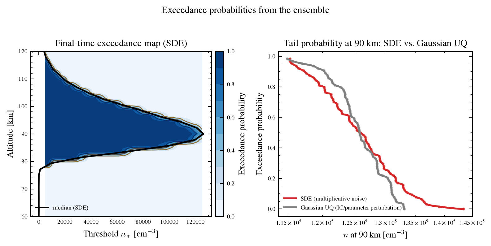

# lorenzsw

# Publication-Oriented Ionospheric Chaos Modeling

`lorenzsw` is a research toolkit for chaotic and stochastic ionospheric
continuity-equation modeling.

It combines Chapman photoionization, precipitation forcing, stochastic
ensemble forecasts, and transfer-operator diagnostics for studying how
electron density evolves and crosses operational thresholds.

### Physics first

Chapman photoionization, precipitation forcing, and loss terms are kept
explicit so each curve in the figures maps to a named physical process.

### Uncertainty visible

The stochastic core propagates ensembles so forecast spread is shown directly
instead of hidden inside a single deterministic line.

### Publication ready

The figures and documentation are styled for paper-style reading, with clean
typography, restrained color, and figure notes that explain the major terms.

## What is included

- Deterministic Chapman and precipitation production models
- Stochastic SDE helpers and ensemble workflows
- Lyapunov and transfer-operator utilities
- Figure scripts for paper-style plots
- Detailed Markdown notes for the governing equations, physical context, and
  figure interpretation

## Quick Links

- [Space Weather Context](space_weather_context.md)
- [Math Description](math_description.md)
- [Example Forecast](example_forecast.md)
- [Source Terms](source_terms.md)
- [Profile Figures](profile_figures.md)
- [Figure Notes](figure_notes.md)
- [Portability](portability.md)
- [Repository Metadata](repository_metadata.md)
- [References](references.md)
- [Deployment](deployment.md)
- [Usage](usage.md)

## A closer look

Exceedance maps and tail probabilities are the
kind of threshold-based visual summary this toolkit is built to make easy to
interpret.

