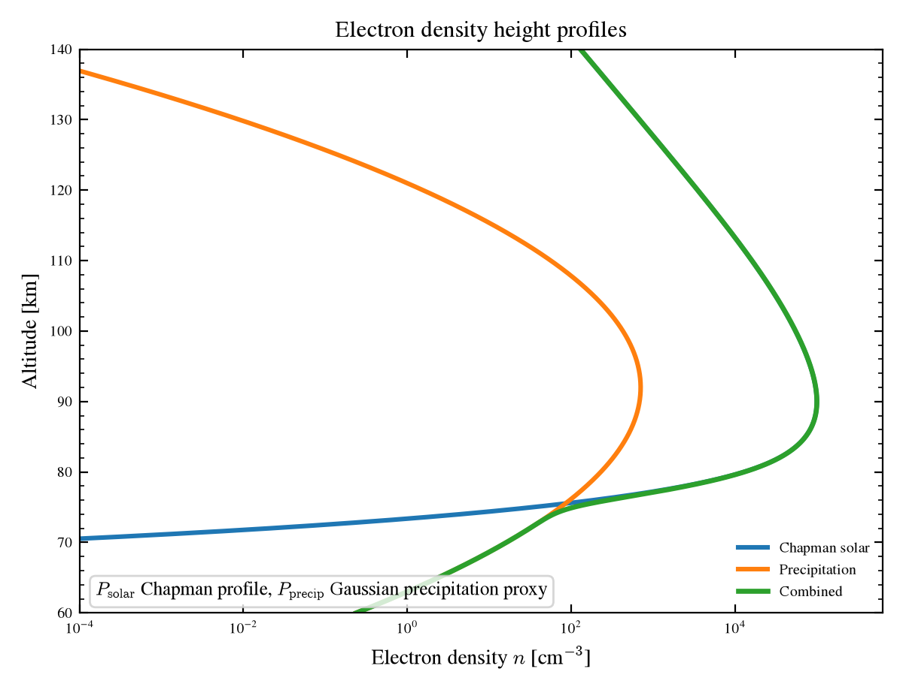
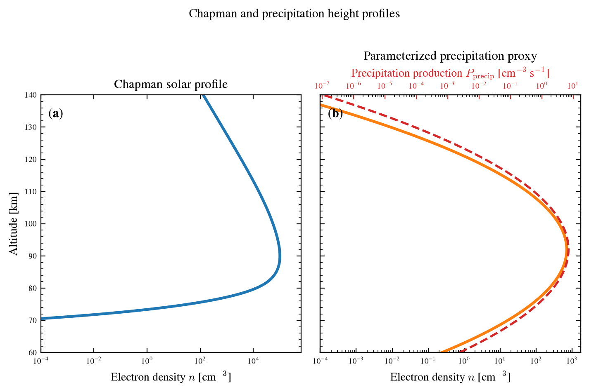

# Profile Figures

These figures show the vertical source-response structure before it is wrapped
into the forecast and uncertainty figures.

## Electron density profiles

This plot compares the solar Chapman contribution, the precipitation
contribution, and the combined equilibrium response.

What it shows:

- the Chapman term produces the broad background profile
- the precipitation term adds a more localized forcing shape
- the combined curve shows how both contributions can reshape the final
  equilibrium density

Why it matters:

- it gives a compact picture of how the two source terms interact
- it helps explain why the full forecast develops structure with altitude
- it is a useful bridge between the individual term figures and the ensemble
  forecast figures

## Chapman and precipitation two-panel figure

This figure separates the Chapman and precipitation responses into two panels.

What it shows:

- left panel: Chapman photoionization response
- right panel: precipitation-driven response
- the overlaid equilibrium curve on the right highlights the link between the
  source term and the implied density response

Why it matters:

- it is the clearest side-by-side comparison of the two drivers
- it makes the different altitude shapes obvious
- it shows why precipitation is a localized perturbation rather than a broad
  background source

## How to use these plots

Use these figures when you want to explain:

- what the model sources look like by themselves
- why the vertical profiles differ
- how the separate source terms combine before the stochastic ensemble is
  applied

